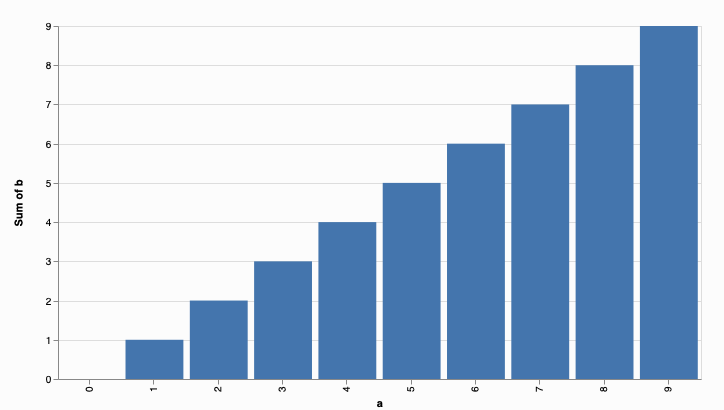
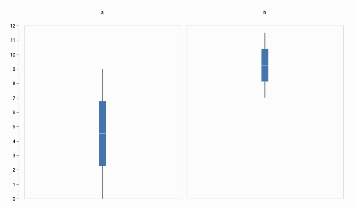
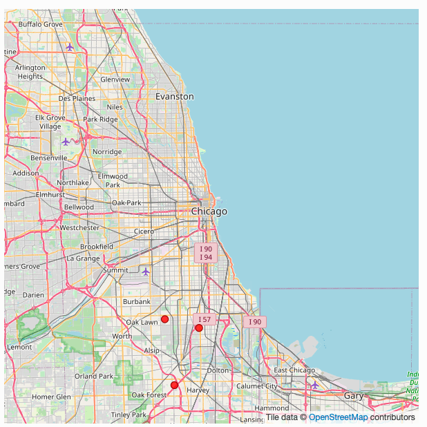
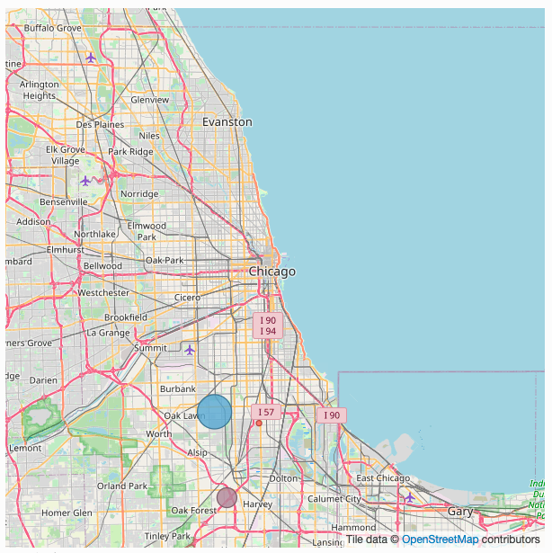
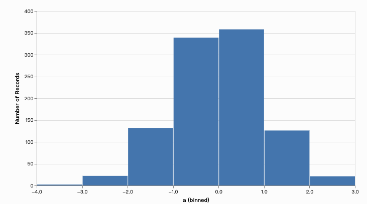
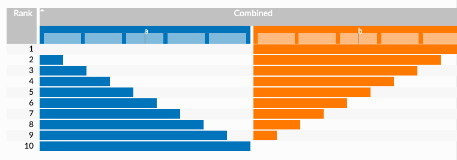
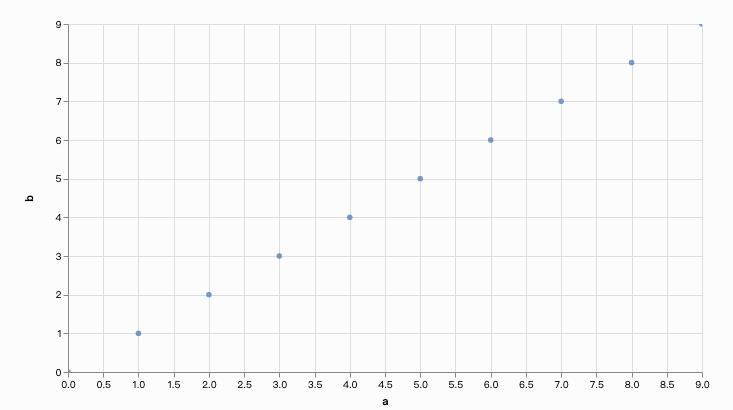

# (PART) Translations {-}

# Chinese Translation of Candela Package

Wenjie Zhu and Jin Qian


```r
library(candela)
```


Source File：https://readthedocs.org/projects/candela/downloads/pdf/latest/  
Github Documentation Link: https://candela.readthedocs.io/en/latest/index.html   

## Candela{.tabset .tabset-fade}
Candela是用于Kitware的Resonant平台的可互操作的Web可视化组件的开源套件, 致力于通过标准化API提供可扩展的丰富可视化效果，以用于现实世界的数据科学应用程序。

集成组件包括：

- LineUp组件：由哈佛大学视觉计算小组和Caleydo项目进行的LineUp动态排名。
- UpSet组件：哈佛大学视觉计算小组和Caleydo项目的UpSet集可视化。
- OnSet组件：由乔治亚理工学院信息接口小组提供的OnSet可视化设置。
- 华盛顿大学互动数据实验室的Vega可视化。示例组件：ScatterPlot。
- 通过Kitware的Resonant平台进行的GeoJS地理空间可视化。示例组件：GeoDots。

### 开始{.tabset .tabset-fade}
#### 快速开始 -- JavaScript  

在名为index.html的文本文件中输入以下内容：

```r
<body>
<div id="vis"></div>
<script src="//unpkg.com/candela/dist/candela.min.js"></script>
<script>

  var data = [
    {x: 1, y: 3},
    {x: 2, y: 4},
    {x: 2, y: 3},
    {x: 0, y: 1}
  ];

  var el = document.getElementById('vis');
  var vis = new candela.components.ScatterPlot(el, {
    data: data,
    x: 'x',
    y: 'y'
  });
  vis.render();

</script>
</body>
```
在浏览器中打开index.html以显示结果可视化。

#### 快速开始 -- Python

请确保您已安装Python 2.7和pip（在Linux和OS X系统上，本地软件包管理器应该足够了；对于Windows，请 [参见此处](https://docs.python-guide.org/starting/install/win/)）。

打开一个shell程序（例如OS X上的终端; Linux上的Bash或Windows上的命令提示符），然后使用以下命令来安装Candela软件包和Requests库，以从网络上获取示例数据：

```r
pip install pycandela requests
```
在UNIX系统上，您可能需要在root或用sudo执行此操作

发出以下命令以在浏览器中启动Jupyter Notebook服务器：

```r
jupyter-notebook
```
Create a notebook from the New menu and enter the following in a cell, followed by Shift-Enter to execute the cell and display the visualization:
从“新建”菜单创建一个笔记本，然后在单元格中输入以下内容，然后按Shift-Enter键执行该单元格并显示可视化效果：

```r
import requests
data = requests.get(
    'https://raw.githubusercontent.com/vega/vega-datasets/gh-pages/data/iris.json'
).json()

import pycandela
pycandela.components.ScatterPlot(
    data=data, color='species', x='sepalLength', y='sepalWidth')
```

#### 快速开始 --  R

下载并安装RStudio。

运行以下指令以安装Candela：

```r
install.packages('devtools')
devtools::install_github('Kitware/candela', subdir='R/candela')
```
使用以下指令以显示mtcars数据集的散点图：

```r
library(candela)
candela('ScatterPlot', data=mtcars, x='mpg', y='wt', color='disp')
```

## Candela 包使用{.tabset .tabset-fade}
### 安装{.tabset .tabset-fade}
有两种方式可安装Candela。从标准组件仓库中下载（例如npm）或者从Python包索引（PyPI）中下载。从组件仓库中下载的方式比较简单，但仅限于能够下载公共发布版本；从源头下载稍显复杂，但能让你下载并运行最新开发版本。

#### 从组件管理系统中安装{.tabset .tabset-fade}
##### JavaScript  
要安装Candela Javascript代码库至当前文件夹，执行以下代码：

```r
npm install candela
```
要安装Candela JavaScript代码库作为你网页应用的dependency, 并且将其加入你的package.json文件中, 执行以下代码:

```r
npm install --save candela
```
独立的JavaScript Candela包可以在node_modules/candela/dist/candela[.min].js中找到。    
\
**使用Webpack安装**  
如果您的项目使用Webpack构建过程，则可以使用Candela的捆绑式Webpack帮助程序功能轻松地将Candela包括在项目中，而不必使用完整大小的捆绑文件。概念是根据项目的需要直接包含Candela源文件，依靠Webpack帮助程序来安排要使用的正确加载程序和其他配置选项。例如，如果没有Webpack，您的源文件可能包含如下行：
```{r，eval=FALSE}
var candela = require('candela/dist/candela.min.js');
var ScatterPlot = candela.components.ScatterPlot;
```
这将导致您的应用程序在运行时加载整个Candela捆绑包，如果您只想使用ScaterPlot组件，则可能不是最佳选择。相反，使用Webpack，可以按以下方式强制转换此代码：
```{r，eval=FALSE}
var ScatterPlot = require('candela/components/ScatterPlot');
```
为了确保您的构建过程为此文件使用了正确的加载程序，您应确保在项目的Webpack配置中使用Candela webpack帮助程序功能：
```{r，eval=FALSE}
var candelaWebpack = require('candela/webpack');
module.exports = candelaWebpack({
  // 这里是你原本的webpack设置 
});
```
这种方法使您的代码更简洁，更有意义，同时避免了不必要的大型应用程序包。

***
##### Python
可以在Python Package Index中找到适用于Candela的Python绑定的最新发行版。安装Candela的最简单方法是通过Python的软件包管理器Pip:  
**1. 安装依赖软件**  
安装以下软件:  

- Python 2.7   
- Pip  

在Linux和OS X计算机上，本地软件包管理器应足以安装它们。在Windows上，请查阅本[指南](http://docs.python-guide.org/en/latest/starting/install/win/)以获取有关Python和Pip的建议。  

**2. 安装Candela Python软件包**  
在shell中使用这行指令来安装Candela包以及依赖项：  
```{r，eval=FALSE}
pip install pycandela
```
您可能需要以管理员账户身份运行此命令，或使用使用sudo或类似方式。

***

#### 从源头进行构建安装 {.tabset .tabset-fade}
在进行源头安装前，您需要使用以下Git指令克隆Candela的代码仓库:

```r
git clone git://github.com/Kitware/candela.git
```
该指令会创建一个名为**candela**的目录。里面包含了Candela的源代码。使用cd指令进入目录：
```{r，eval=FALSE}
cd candela
```

##### JavaScript  
Candela在GitHub上进行开发。如果您希望贡献代码或获取到最新开发版本，则可以按照以下步骤从GitHub下载，构建和安装：  
**1.下载依赖软件**  
要从源代码构建Candela，您将需要安装以下软件：

- Git
- Node.js
- npm
- cairo (在macOS操作系统上使用*brew install cairo*)

**2.安装节点依赖项**  
使用以下指令以通过节点软件包管理器（NPM）安装必要的节点依赖项：

```r
npm install
```
需要的软件包将会被安装至名为*node_modules*的目录中。

**3.开始构建过程**  
使用以下指令开始开始构建过程：

```r
npm run build
```
输出将会在*build/candela/candela.js*中创建一个构建完成的Candela软件包。
观察输出是否有任何错误。大多数情况下，指令运行错误会终止整个构建过程，并打印出具体错误信息。如果你需要任何解读错误信息的帮助，请在[GitHub issues](https://github.com/Kitware/candela/issues/new)或者[Gitter](https://gitter.im/Kitware/candela) chat里给我们留言。 

**4.查看示例**  
Candela包含了许多测试需要的示例。它们也有助于学习Candela提供的多种可视化效果。要构建示例，请执行以下代码：

```r
npm run build:examples
```
查看示例，执行以下代码：

```r
npm run examples
```

**5.运行测试套件**  
Candela配有一系列测试。要运行测试套件，你需要调用测试任务如下：

```r
npm run test:all
```
以上代码会执行单元以及图像测试。每个测试套件可单独用以下代码运行：

```r
npm run test:unit
```
以及：

```r
npm run test:image
```
以上每行指令都会在命令行生成摘要报告。

**6. 建立文件**
Candela使用[ReadTheDocs](https://candela.readthedocs.io/)主机上托管的[Sphinx](http://www.sphinx-doc.org/) 文档。要在本地构建文档，请首先安装所需的Python依赖项：

```r
pip install -r requirements-dev.txt
```
当安装完成后，运行以下指令：

```r
npm run docs
```
文档将托管在 http://localhost:3000/ 主机上。

***
##### Python  
**1. 安装软件依赖项**  
要从Python使用Candela，您将需要Python 2.7和pip。  
**2.在本地安装库**

```r
pip install -e .
```
**3.测试安装**
使用以下指令以在浏览器中启动Jupyter Notebook服务器：

```r
jupyter-notebook
```
从“新建”菜单中创建一个笔记本，然后在单元格中输入以下内容，然后按Shift-Enter键执行该单元格并显示可视化效果：

```r
import requests
data = requests.get(
    'https://raw.githubusercontent.com/vega/vega-datasets/gh-pages/data/iris.json'
).json()

import pycandela
pycandela.components.ScatterPlot(
    data=data, color='species', x='sepalLength', y='sepalWidth')
```

***

##### R-使用install_github或Git Checkout  
此过程将直接从GitHub或从Candela的本地Git Checkout安装Candela。  
**1.安装[R](https://www.r-project.org/)，并选择性安装[RStudio](https://www.rstudio.com/)**  
**2.安装Candela软件包**  
要直接从GitHub安装：

```r
install.packages('devtools')
devtools::install_github('Kitware/candela', subdir='R/candela', dependencies = TRUE)
```
要从Git checkout安装，请将工作目录设置为Git checkout，然后安装并检查安装。check()将运行测试并执行其他程序包检查。

```r
install.packages('devtools')
devtools::install(dependencies = TRUE)
devtools::check()
```
**3.测试安装**  
下面将创建mtcars数据集的散点图并将其保存到out.html：

```r
w <- candela('ScatterPlot', data=mtcars, x='mpg', y='wt', color='disp')
htmlwidgets::saveWidget(w, 'out.html')
```
在RStudio中，当您引用可视化而不将其分配给变量时，可视化将出现在您的应用程序中：
```{r，eval=FALSE}
w
```

**注意：** saveWidget在RStudio外部运行时，需要安装Pandoc。请参阅[安装说明](https://github.com/rstudio/rmarkdown/blob/master/PANDOC.md)进行安装。

***

### 版本控制
Candela 使用语义法版本命名法来命名版本号。这意味着每个发行版的版本号都可以确定该发行版中存在的功能级别和向后兼容性。 Candela的版本号有两种形式: x.y 和 x.y.z。x为主版本号, y为次版本号, z为补丁版本号。

遵循语义版本控制方法，主要版本代表了整个软件的稳定API。如果主版本号增加，则意味着可以向后兼容。也就是说，适用于1.3版的设置将适用于1.4、1.5和1.10版，但不应期望与2.0版一起使用。

次版本号代表了在前版中加入了新功能。所以1.1版将包含1.0版中未提供的某些功能，且可以确保向后兼容。

当对软件进行错误修复或其他更正时，补丁版本号将递增。

主版本号0比较特殊：本质上，在0.y系列中不保证兼容性。API和行为的稳定性从1.0版开始。

除了标准的语义版本控制做法外，Candela还在Git存储库中将当前版本号标记为“ dev”，从而为从源代码构建的Candela软件包产生了诸如“ 1.1dev”的版本号。发行协议会在将包上传到Python包索引之前，从版本号中删除该标签。

***


## 组件
### 条形图 (BarChart)
条形图。 x变量应为每个条形包含不同的值，而y变量将对应于每个条形的高度。颜色变量可用于为每个条着色。在单个x值有多个记录的情况下，可以使用合计将值组合成单个条。

该组件可以在candela/plugins/vega插件中找到。

#### 示例


**JavaScript**

```r
<script src="//unpkg.com/candela/dist/candela.min.js"></script>
<script>
  var el = document.createElement('div')
  document.body.appendChild(el);

  var data = [];
  for (var d = 0; d < 10; d += 1) {
    data.push({
      a: d,
      b: d
    });
  }

  var vis = new candela.components.BarChart(el, {
    data: data,
    x: 'a',
    y: 'b'
  });
  vis.render();
</script>
</body>
```
**Python**

```r
import pycandela

data = [{'a': d, 'b': d} for d in range(10)]

pycandela.components.BarChart(data=data, x='a', y='b')
```
**R**

```r
library(candela)

candela('BarChart', data=mtcars, x='mpg', y='wt', color='disp')
```

#### 可选参数
- **data (Table)**  
数据表。

- **x (String)**  
x轴（条形位置）变量。 必须包含数字类数据。 请参见坐标轴刻度。

- **xType (String)**  
x变量的数据类型。 默认值为'nominal'。

- **y (String)**  
y轴（条形高度）变量。 必须包含数字类数据。 请参见坐标轴刻度。

- **yType (String)**  
y变量的数据类型。 默认值为'quantitative'。

- **color (String)**  
用于为条形着色的变量。

- **colorType (String)**  
颜色变量的数据类型。 默认值为'nominal'。

- **aggregate (String)**  
当多个记录中的x值相同时，y值的合计模式。 默认值为'sum'。

- **width (Number)**  
图表的宽度（以像素为单位）。 请参阅调整大小。

- **height (Number)**  
图表的高度（以像素为单位）。 请参阅调整大小。

- **renderer (String)**  
是否以'svg'或'canvas'模式渲染（默认为'画布'）。


### 箱线图 (BoxPlot)
箱线图。可视化采用一组测量数据（变量），并为每个测量生成箱线图。可选的group变量会将数据划分为具有匹配数值的小组，并为每个组创建一个或一组箱形图。

该组件可以在candela/plugins/vega插件中找到。

#### 示例 


**JavaScript**

```r
<body>
<script src="//unpkg.com/candela/dist/candela.min.js"></script>
<script>
  var el = document.createElement('div')
  document.body.appendChild(el);

  var data = [];
  for (var d = 0; d < 10; d += 1) {
    data.push({
      a: d,
      b: d/2 + 7
    });
  }

  var vis = new candela.components.BoxPlot(el, {
    data: data,
    fields: ['a', 'b']
  });
  vis.render();
</script>
</body>
```
**Python**

```r
data = [{'a': d, 'b': d/2 + 7} for d in range(10)]

pycandela.components.BoxPlot(data=data, fields=['a', 'b'])
```
**R**

```r
library(candela)

candela('BoxPlot', data=mtcars, fields=c('mpg', 'wt', 'disp'))
```

#### 可选参数 
- **data (Table)**  
数据表。

- **fields (Array of String)**  
用作于测量的变量。 可视化将为每个变量生成一个箱线图。必须包含数字或时间数据。请参见坐标轴刻度。 坐标轴类型将由数组中第一个变量的推断值选择。

- **x (String)**  
group by 所使用的可选参数。 默认情况下，所有记录都放在一个组中。 请参见轴刻度。
x轴（条形位置）变量。 必须包含数字类数据。 请参见坐标轴刻度。

- **xType (String)**  
x变量的数据类型。 默认值为'nominal'。

- **color (String)**  
用于为箱形图着色的变量。

- **colorType (String)**  
颜色变量的数据类型。 默认值为'nominal'。

- **width (Number)**  
图表的宽度（以像素为单位）。 请参阅调整大小。

- **height (Number)**  
图表的高度（以像素为单位）。 请参阅调整大小。

- **renderer (String)**  
是否以'svg'或'canvas'模式渲染（默认为'画布'）。

### 甘特图 (GanttChart)  
甘特图。 数据表必须包含两个数字变量，start和end，用于指定水平条的开始和结束。 label变量可以指定每个项目的名称。

该组件可以在candela/plugins/vega插件中找到。

#### 示例  


**JavaScript**

```r
<body>
<script src="//unpkg.com/candela/dist/candela.min.js"></script>
<script>
  var el = document.createElement('div')
  document.body.appendChild(el);

  var data = [
    {name: 'Do this', level: 1, start: 0, end: 5},
    {name: 'This part 1', level: 2, start: 0, end: 3},
    {name: 'This part 2', level: 2, start: 3, end: 5},
    {name: 'Then that', level: 1, start: 5, end: 15},
    {name: 'That part 1', level: 2, start: 5, end: 10},
    {name: 'That part 2', level: 2, start: 10, end: 15}
  ];
  var vis = new candela.components.GanttChart(el, {
    data: data, label: 'name',
    start: 'start', end: 'end', level: 'level',
    width: 700, height: 200
  });
  vis.render();
</script>
</body>
```
**Python**

```r
import pycandela

data = [
    dict(name='Do this', level=1, start=0, end=5),
    dict(name='This part 1', level=2, start=0, end=3),
    dict(name='This part 2', level=2, start=3, end=5),
    dict(name='Then that', level=1, start=5, end=15),
    dict(name='That part 1', level=2, start=5, end=10),
    dict(name='That part 2', level=2, start=10, end=15)
];
pycandela.components.GanttChart(
    data=data, label='name',
    start='start', end='end', level='level',
    width=700, height=200
)
```
**R**

```r
library(candela)

data <- list(
    list(name='Do this', level=1, start=0, end=5),
    list(name='This part 1', level=2, start=0, end=3),
    list(name='This part 2', level=2, start=3, end=5),
    list(name='Then that', level=1, start=5, end=15),
    list(name='That part 1', level=2, start=5, end=10),
    list(name='That part 2', level=2, start=10, end=15))

candela('GanttChart',
    data=data, label='name',
    start='start', end='end', level='level',
    width=700, height=200)
```

#### 可选参数  
- **data (Table)**   
数据表。

- **label (String)**   
用于标记每个任务的字段。

- **start (String)**   
代表每个任务结束开始的变量。 必须为数字。

- **end (String)**   
代表每个任务结束刻度的变量。 必须为数字。

- **level (String)**   
用作分层项目级别的字符串。 当前支持两个不同的值，遇到的第一个值将是级别1，该级别将展现的更为突出，而第二个值将是级别2。

- **type (String)**   
开始和结束变量的数据类型。 默认值为'quantitative'。

- **tickCount (String)**   
建议沿x轴放置的刻度线数量。

- **axisTitle (String)**   
x轴的标题。

- **width (Number)**   
图表的宽度（以像素为单位）。 请参阅调整大小。

- **height (Number)**   
图表的高度（以像素为单位）。 请参阅调整大小。

- **renderer (String)**   
是否以'svg'或'canvas'模式渲染（默认为'画布'）。

### 地理空间图 (Geo) 
使用GeoJS的地理空间图。

该组件可以在candela/plugins/geojs插件中找到。

#### 示例

**JavaScript**

```r
<body>
<script src="//unpkg.com/candela/dist/candela.min.js"></script>
<script>
  var el = document.createElement('div')
  el.style.width = '500px';
  el.style.height = '500px';
  document.body.appendChild(el);

  var data = [
    {lat: 41.702, lng: -87.644},
    {lat: 41.617, lng: -87.693},
    {lat: 41.715, lng: -87.712}
  ];
  var vis = new candela.components.Geo(el, {
    map: {
      zoom: 10,
      center: {
        x: -87.6194,
        y: 41.867516
      }
    },
    layers: [
      {
        type: 'osm'
      },
      {
        type: 'feature',
        features: [
          {
            type: 'point',
            data: data,
            x: 'lng',
            y: 'lat'
          }
        ]
      }
    ]
  });
  vis.render();
</script>
</body>
```
**Python**

```r
import pycandela

data = [
    dict(lat=41.702, lng=-87.644),
    dict(lat=41.617, lng=-87.693),
    dict(lat=41.715, lng=-87.712)
]

pycandela.components.Geo(
    map=dict(
        zoom=10,
        center=dict(x=-87.6194, y=41.867516)
    ),
    layers=[
        dict(type='osm'),
        dict(
            type='feature',
            features=[
                dict(type='point', data=data, x='lng', y='lat')
            ]
        )
    ]
)
```
**R**

```r
library(candela)

data = list(
  list(lat=41.702, lng=-87.644),
  list(lat=41.617, lng=-87.693),
  list(lat=41.715, lng=-87.712))

candela('Geo',
  map=list(
    zoom=10,
    center=list(x=-87.6194, y=41.867516)
  ),
  layers=list(
    list(type='osm'),
    list(
      type='feature',
      features=list(
        list(type='point', data=data, x='lng', y='lat')
      )
    )
  )
)
```
#### 可选参数  

- **map (Object)**   
描述GeoJS地图选项的key-value对。

- **layers (Array of Layer)**   
地图的图层。

#### Layers详述
图层包含描述[GeoJS图层选项](http://opengeoscience.github.io/geojs/apidocs/geo.layer.html)的key-value对。 这些选项会传递给GeoJS，但type设置为'feature'的图层的'feature'选项除外。 在这种情况下，'feature'选项是一组Feature的详述。

#### Feature详述
每个feature都是具有以下属性的对象：  

- **name (String)**   
feature的名字。

- **type (String)**  
feature的类 （现支持：'point'）。

- **data (Table)**  
数据表。

- **x (String)**  
用于feature的x轴参数。

- **y (String)**  
用于feature的y轴参数。

### 地理点图(GeoDots) 
使用[GeoJS](https://geojs.readthedocs.io/)的地理空间视图，其位置用点标记。 纬度（latitude）和经度 （longitude）变量包含数据中每个位置的经/纬度值。

该组件可以在candela/plugins/geojs插件中找到。

#### 示例  


**JavaScript**

```r
<body>
<script src="//unpkg.com/candela/dist/candela.min.js"></script>
<script>
 var el = document.createElement('div')
 el.style.width = '500px';
 el.style.height = '500px';
 document.body.appendChild(el);

 var data = [
   {lat: 41.702, lng: -87.644, a: 5},
   {lat: 41.617, lng: -87.693, a: 15},
   {lat: 41.715, lng: -87.712, a: 25}
 ];
 var vis = new candela.components.GeoDots(el, {
   zoom: 10,
   center: {
     longitude: -87.6194,
     latitude: 41.867516
   },
   data: data,
   latitude: 'lat',
   longitude: 'lng',
   size: 'a',
   color: 'a'
 });
 vis.render();
</script>
</body>
```
**Python**

```r
import pycandela

data = [
    dict(lat=41.702, lng=-87.644, a=5),
    dict(lat=41.617, lng=-87.693, a=15),
    dict(lat=41.715, lng=-87.712, a=25)
]

pycandela.components.GeoDots(
    zoom=10,
    center=dict(longitude=-87.6194, latitude=41.867516),
    data=data,
    latitude='lat',
    longitude='lng',
    size='a',
    color='a'
)
```
**R**

```r
library(candela)

data = list(
  list(lat=41.702, lng=-87.644, a=5),
  list(lat=41.617, lng=-87.693, a=15),
  list(lat=41.715, lng=-87.712, a=25))

candela('GeoDots',
  zoom=10,
  center=list(longitude=-87.6194, latitude=41.867516),
  data=data,
  latitude='lat',
  longitude='lng',
  size='a',
  color='a')
```

#### 可选参数
- **data (Table)**  
数据表。

- **longitude (String)**  
经度变量。

- **latitude (String)**  
纬度变量。

- **color (String)**   
用来为点着色的变量。

- **size (String)**  
用来确定点的大小的变量。 该字段必须包含数字值。

- **zoom (Integer)**  
初始缩放程度。

- **center (Object)**  
具有经度和纬度属性的对象，用于指定地图的初始中心。

- **tileUrl (String)**  
切片URL模板（请参见[GeoJS OSM图层选项](http://opengeoscience.github.io/geojs/apidocs/geo.osmLayer.html)）。 设置为null可完全禁用OSM层。

### 图级操作 (GLO - Graph-Level Operations)
可视化框架。将数据看作图形的节点，使用定位和视觉命令将它们排列为不同的格式，以实现不同的可视化。

节点表包含一个对象列表，每个对象都有一个包含唯一标识符的id变量以及所需的其他数据属性。边缘表（edges table）包含源头和目标变量（各自指向引用节点表中的id值）、无向或有向的可选类变量、标识每个边缘的id参数、以及权重值（可选）。 width和height控制用于呈现可视化效果的画布的大小。

该组件可以在candela/plugins/glo插件中找到。

#### 示例  


**JavaScript**

```r
<body>
<script src="//unpkg.com/candela/dist/candela.min.js"></script>
<script>
  var el = document.createElement('div')
  el.setAttribute('width', 700);
  el.setAttribute('width', 700);

  document.body.appendChild(el);

  var alphabet = 'abcdefghijklmnopqrstuvwxyz';
  var vowels = 'aeiou'.split('');

  var nodes = [];
  for (var i = 0; i < 26; i++) {
    var letter = {
      id: i,
      label: alphabet[i],
      vowel: vowels.indexOf(alphabet[i]) > 0 ? 'vowel' : 'consonant'
    };

    for (var j = 0; j < 26; j++) {
      letter[alphabet[j]] = Math.abs(j - i);
    }

    nodes.push(letter);
  }

  var edges = [];
  var counter = 0;
  for (var i = 0; i < 26; i++) {
    for (var j = i + 1; j < 26; j++) {
      if (nodes[i][alphabet[j]] > 20) {
        edges.push({
          source: i,
          target: j,
          type: 'Undirected',
          id: counter++,
          weight: 1
        });
      }
    }
  }

  var vis = new candela.components.Glo(el, {
    nodes: nodes,
    edges: edges,
    width: 700,
    height: 200
  });

  vis.render();

  vis.distributeNodes('x');
  vis.colorNodesDiscrete('vowel');
  vis.curvedEdges();
</script>
</body>
```
**Python**

```r
import pycandela

data = [
  {'id': 0, 'label': 'A', 'class': 0},
  {'id': 1, 'label': 'B', 'class': 1},
  {'id': 2, 'label': 'C', 'class': 1}
]

edges = [
  {'id': 0, 'source': 0, 'target': 1},
  {'id': 1, 'source': 0, 'target': 2},
  {'id': 2, 'source': 2, 'target': 1}
]

glo = pycandela.components.Glo(nodes=nodes, edges=edges)
glo.render()
glo.distributeNodes('x');
glo.colorNodesDiscrete('class');
glo.curvedEdges();
```
**R**

```r
library(candela)

id = c(0, 1, 2)
label = c('A', 'B', 'C')
class = c(0, 1, 1)
nodes = data.frame(id, label, class)

source = c(0, 0, 2)
target = c(1, 2, 1)
edges = data.frame(id, source, target)

glo = candela('SimilarityGraph', nodes=nodes, edges=edges)
glo.render()
glo.distributeNodes('x')
glo.colorNodesDiscrete('class')
glo.curvedEdges()
```

#### 可选参数
- **nodes (Table)**  
节点表。

- **edges (Table)** 
边缘表。

- **width (number)**  
绘图区域宽度。

- **height (number)**
绘图区域高度。

#### 函数方程
> colorNodesDiscrete(field)  
**参数：	- field (string)** -- 要着色的变量
使用分类颜色图（color map）通过变量中的值为节点着色。

> colorNodesContinuous(field)  
**参数：	- field (string)** -- 要着色的变量
使用连续的颜色图（color map）通过变量中的值为节点着色。

> colorNodesDefault()  
将节点颜色恢复为默认状态（无颜色图）。

> sizeNodes(field)  
**参数：	- field (string)** -- 用于调整大小的变量
根据变量中的值调整节点的大小。

> sizeNodesDefault()  
将节点大小恢复为默认状态（固定大小）。

> distributeNodes(axis[, attr])  
**参数：	- string (attr)** -- 分布节点的轴  
-**string** -– 用于对节点进行分组的参数  
沿轴均匀放置节点，该轴必须是“ x”，“ y”，“ rho”（径向轴）或“ theta”（角度轴）之一。如果指定了attr，则将根据此attr对节点进行分区和分组。

> positionNodes(axis, value)  
**参数:	- axis (string)** -- 分布节点的轴
- **value (string|number)** -- 用于绘制位置数据的变量或常量
根据值中的数据沿轴定位节点（请参见distributionNodes()）。如果value是字符串，则表示节点表中的列；如果是数字，则所有节点都将被放置于该位置。

> forceDirected()  
将力导引算法（force-directed positioning）应用于节点。

> showEdges()  
展示所有节点之间的边。

> hideEdges()  
隐藏所有节点之间的边。

> fadeEdges()  
使用透明的灰色渲染边缘。

> solidEdges()  
使用黑色渲染边缘。

> incidentEdges()  
仅在鼠标指针悬停在节点上时，渲染入射在该节点上的边缘。

> curvedEdges()  
使用曲线渲染边缘。

> straightEdges()  
使用直线渲染边缘。

### 直方图 (Histogram)
直方图。参数`bin`指定要汇总的字段。默认情况下，数据表`data`中的每条记录占`bin`的总数的1。 通过指定一个汇总字段`aggregate`，将在每个`bin`里加总该字段。
该组件可以在`candela/plugins/vega`插件中找到。

#### 示例 


**JavaScript**

```r
<body>
<script src="//unpkg.com/candela/dist/candela.min.js"></script>
<script>
  var el = document.createElement('div')
  document.body.appendChild(el);

  var data = [];
  for (var d = 0; d < 1000; d += 1) {
    data.push({
      a: Math.sqrt(-2*Math.log(Math.random()))*Math.cos(2*Math.PI*Math.random())
    });
  }

  var vis = new candela.components.Histogram(el, {
    data: data,
    x: 'a',
    width: 700,
    height: 400
  });
  vis.render();
</script>
</body>
```

**Python**

```r
import pycandela
from random import normalvariate as nv

data = [{'a': nv(0, 1)} for d in range(1000)]

pycandela.components.Histogram(data=data, x='a', width=700, height=400)
```

**R**

```r
library(candela)
candela('Histogram', data=mtcars, x='mpg')
```

#### 可选参数
- **data (Table)**
数据表。

- **x (String)**
x轴字段，组合为直方图。

- **xType (String)**
`x`字段的数据类型。默认值是“名义变量”。

- **aggregate (String)**
每个直方图bin中`y`值的聚合模式。默认值为“计数”，它不使用`y`值，但将统计bin中出现的记录数。

- **y (String)**
y轴字段，当没设置聚合为“计数”时，用于确定直方图条的高度。

- **yType (String)**
`y`字段的数据类型。默认值为“定量”。

- **color (String)**
用于为条形着色的字段。

- **colorType (String)**
颜色字段的数据类型。默认值为“名义变量”。

- **width (Number)**
图表的宽度（以像素为单位）。请参阅API文件的尺寸调整。

- **height (Number)**
图表的高度（以像素为单位）。请参阅API文件的尺寸调整。

- **renderer (String)**
以“矢量图形(svg)”或“画布(canvas)”绘制图像。（默认为“画布”）。


### 折线图 (LineChart)
折线图。该图表针对单个`x`字段绘制了`y`字段的线，可以选择使用系列字段`series`将其分成多条线。
该组件可以在candela/plugins/vega插件中找到。

#### 示例


**JavaScript**

```r
<body>
<script src="//unpkg.com/candela/dist/candela.min.js"></script>
<script>
  var el = document.createElement('div')
  document.body.appendChild(el);

  var data = [];
  for (var d = 0; d < 10; d += 1) {
    data.push({
      a: d,
      b: d
    });
  }

  var vis = new candela.components.LineChart(el, {
    data: data,
    x: 'a',
    y: 'b',
    width: 700,
    height: 400
  });
  vis.render();
</script>
</body>
```

**Python**

```r
import pycandela

data = [{'a': d, 'b': d} for d in range(10)]

pycandela.components.LineChart(
    data=data, x='a', y='b', width=700, height=400)
```
**R**

```r
library(candela)

candela('LineChart', data=mtcars, x='mpg', y='wt', color='disp')
```

#### 可选参数
- **data (Table)**<br>
数据表。
<br>

- **x (String)**<br>
x轴字段，组合为直方图。
<br>

- **xType (String)**<br>
x字段的数据类型。默认值是“名义变量”。
<br>

- **y (String)**<br>
y轴字段，当没设置聚合为“计数”时，用于确定直方图条的高度。
<br>

- **yType (String)**<br>
y字段的数据类型。默认值为“定量”。
<br>

- **series (String)**<br>
用于将数据分隔成多行的可选字段。
<br>

- **seriesType (String)**<br>
序列字段的数据类型。默认值为“名义变量”。
<br>

- **colorSeries (Boolean)**<br>
是否为不同序列上色并显示图例。默认为“是”。
<br>

- **showPoints (Boolean)**<br>
是否在直线上添加点。默认值为“否”。
<br>

- **width (Number)**<br>
图表的宽度（以像素为单位）。请参阅API文件的尺寸调整。
<br>

- **height (Number)**<br>
图表的高度（以像素为单位）。请参阅API文件的尺寸调整。
<br>

- **renderer (String)**<br>
以“矢量图形(svg)”或“画布(canvas)”绘制图像。（默认为“画布”）。
<br>

### 排序图(Lineup)
LineUp用于排名可视化。
可以在candela/plugins/lineup插件中找到该组件。

#### 示例

**JavaScript**

```r
<body>
<script src="//unpkg.com/candela/dist/candela.min.js"></script>
<script>
  var el = document.createElement('div')
  document.body.appendChild(el);

  var data = [];
  for (var d = 0; d < 10; d += 1) {
    data.push({
      a: d,
      b: 10 - d,
      name: d
    });
  }

  var vis = new candela.components.LineUp(el, {
    data: data,
    fields: ['a', 'b']
  });
  vis.render();
</script>
</body>
```

**Python**

```r
import pycandela

data = [{'a': d, 'b': 10 - d, 'name': d} for d in range(10)]

pycandela.components.LineUp(data=data, fields=['a', 'b'])
```
**R**

```r
library(candela)

candela('LineUp', data=mtcars, fields=c('_row', 'mpg', 'wt', 'disp'))
```

#### 可选参数
- **data (Table)**<br>
数据表。
<br>

- **fields (Array of String)**<br>
将在LineUp视图上显示的字段列表。该列表确定字段的顺序。如果未提供，则显示数据中的所有字段。
<br>

- **stacked (Boolean)**<br>
是否将分组的度量显示为堆叠的条形（默认为“否”）。
<br>

- **histograms (Boolean)**<br>
是否在每个度量的标题中显示直方图（默认为“是”）。
<br>

- **animation (Boolean)**<br>
是否在评分标准更改时设置过渡动画（默认为“是”）。
<br>

### OnSet组件 (OnSet)
#### 示例
[OnSet](https://www.cc.gatech.edu/gvu/ii/setvis/)集合可视化.<br>

OnSet将二进制列（即每行中文本为“ 0”或“ 1”，“true”或“false”，“yes”或“no”的列）解释为集合。 `sets`选项中的任何字段都将以这种方式解释。 由于大多数数据不是按二进制列排列的，因此可视化还通过`field`选项支持任意类别的字段。 此列表中指定的每个字段首先将被预处理为一个集合集，每个集合值对应的名称为` <fieldName><value>`<br>

例如，假设数据表为：

```r
[
  {"id": "n1", "f1": 1, "f2": "x"},
  {"id": "n2", "f1": 0, "f2": "x"},
  {"id": "n3", "f1": 0, "f2": "y"}
]
```

可以使用以下选项创建OnSet可视化：

```r
new OnSet({
  data: data,
  id: 'id',
  sets: ['f1'],
  fields: ['f2']
});
```

如下所示，这会将`f2`字段预处理为`f2 x`和`f2 y`，并使它们可用于OnSet：

```r
f1: n1
f2 x: n1, n2
f2 y: n3
```

如果`rowSets`选项设置为**true**，则集合将转变为：

```r
n1: f1, f2 x
n2: f2 x
n3: f2 y
```

该组件可以在candela/plugins/onset插件中找到。

#### 可选参数
- **data (Table)**<br>
数据表。
<br>

- **id (String)**<br>
包含每个记录的唯一ID的字段。
<br>

- **fields (Array of String)**<br>
分类字段的列表，这些字段将每个字段中每个不同值的转换为0/1组集合，并填充在OnSet视图中。
<br>

- **rowSets (Boolean)**<br>
如果为**false**，则将列视为集合；如果为**true**，则将行视为集合。默认为“否”。
<br>

### 散点图 (ScatterPlot)
散点图。 该可视化将在指定的`x`和`y`位置绘制值。其他字段可以确定绘制点的颜色`color`，大小`size`和形状`shape`。

该组件可以在candela/plugins/vega插件中找到。
#### 示例  



**JavaScript**

```r
<body>
<script src="//unpkg.com/candela/dist/candela.min.js"></script>
<script>
  var el = document.createElement('div')
  document.body.appendChild(el);

  var data = [];
  for (var d = 0; d < 10; d += 1) {
    data.push({
      a: d,
      b: d
    });
  }

  var vis = new candela.components.ScatterPlot(el, {
    data: data,
    x: 'a',
    y: 'b',
    width: 700,
    height: 400
  });
  vis.render();
</script>
</body>
```

**Python**

```r
import pycandela

data = [{'a': d, 'b': d} for d in range(10)]

pycandela.components.ScatterPlot(
    data=data, x='a', y='b', width=700, height=400)
```
**R**

```r
library(candela)

candela('ScatterPlot', data=mtcars, x='mpg', y='wt', color='disp')
```

#### 可选参数
- **data (Table)**<br>
数据表。
<br>

- **x (String)**<br>
x轴字段。
<br>

- **xType (String)**<br>
`x`字段的数据类型。默认值是“名义变量”。
<br>

- **y (String)**<br>
y轴字段。
<br>

- **yType (String)**<br>
`y`字段的数据类型。默认值为“定量”。
<br>

- **color (String)**<br>
该字段用于给点上色。
<br>

- **colorType (String)**<br>
`color`颜色字段的数据类型。默认为“名义变量”。
<br>

- **size (String)**<br>
该字段用于改变点的大小。
<br>

- **sizeType (String)**<br>
`size`大小字段的数据类型。默认值为“定量”。
<br>

- **shape (String)**<br>
该字段用于改变点的形状。
<br>

- **shapeType (String)**<br>
`shape`形状字段的数据类型。默认值为“名义变量”。
<br>

- **filled (String)**<br>
是填充点还是仅绘制轮廓。默认值为“是”。
<br>

- **width (Number)**<br>
图表的宽度（以像素为单位）。请参阅API文件的尺寸调整。
<br>

- **height (Number)**<br>
图表的高度（以像素为单位）。请参阅API文件的尺寸调整。
<br>

- **renderer (String)**<br>
以“矢量图形(svg)”或“画布(canvas)”绘制图像。（默认为“画布”）。
<br>

### 散点图矩阵 (ScatterPlotMatrix)
散点图矩阵。该可视化将为每对指定字段`fields`绘制散点图。其他字段可以确定点的大小`size`，颜色`color`和形状`shape`。
该组件可以在candela/plugins/vega插件中找到。

#### 示例 


**JavaScript**

```r
<body>
<script src="//unpkg.com/candela/dist/candela.min.js"></script>
<script>
  var el = document.createElement('div')
  document.body.appendChild(el);

  var data = [];
  for (var d = 0; d < 10; d += 1) {
    data.push({
      a: d,
      b: 10 - d,
      name: d
    });
  }

  var vis = new candela.components.ScatterPlotMatrix(el, {
    data: data,
    fields: ['a', 'b']
  });
  vis.render();
</script>
</body>
```

**Python**

```r
import pycandela

data = [{'a': d, 'b': 10 - d, 'name': d} for d in range(10)]

pycandela.components.ScatterPlotMatrix(data=data, fields=['a', 'b'])
```
**R**

```r
library(candela)

candela('ScatterPlotMatrix', data=mtcars, fields=c('mpg', 'wt', 'disp'))
```

#### 可选参数
- **data (Table)**<br>
数据表。
<br>

- **fields (Array of String)**<br>
该字段在散点图矩阵中用作轴。指定N个字段将生成N x N的散点图矩阵。
<br>

- **color (String)**<br>
该字段用于给点上色。
<br>

- **colorType (String)**<br>
颜色字段的数据类型。默认为“名义变量”。
<br>

- **size (String)**<br>
该字段用于改变点的大小。
<br>

- **sizeType (String)**<br>
`size`大小字段的数据类型。默认值为“定量”。
<br>

- **shape (String)**<br>
该字段用于改变点的形状。
<br>

- **shapeType (String)**<br>
`shape`形状字段的数据类型。默认值为“名义变量”。
<br>

- **filled (String)**<br>
是填充点还是仅绘制轮廓。默认值为“是”。
<br>

- **width (Number)**<br>
图表的宽度（以像素为单位）。请参阅API文件的尺寸调整。
<br>

- **height (Number)**<br>
图表的高度（以像素为单位）。请参阅API文件的尺寸调整。
<br>

- **renderer (String)**<br>
以“矢量图形(svg)”或“画布(canvas)”绘制图像。（默认为“画布”）。
<br>


### 词树 (SentenTree)
[词树](https://github.com/twitter/SentenTree)：句子可视化。
给定一个有关某个主题的文本样本表，SentenTree尝试抽象出它们之间的共同表达，将它们可视化为“句子树”。

数据表`data`包含一系列对象，每个对象都有一个`id`字段，该字段包含每行的唯一标识符，一个文本`text`字段，包含文本样本，一个计数`count`字段，表示该样本的强度或在语料库中发生的次数等。

可以在candela/plugins/sententree插件中找到此组件。
#### 示例  


**JavaScript**

```r
<body>
<script src="//unpkg.com/candela/dist/candela.min.js"></script>
<script>
  var el = document.createElement('div')
  el.setAttribute('width', 1200);
  el.setAttribute('width', 700);

  document.body.appendChild(el);

  var data = [
    {id: 0, count: 3787, text: 'brazil\'s marcelo scores the first goal of the world cup ... against brazil.'},
    {id: 1, count: 2878, text: 'at least brazil have scored the first goal of the world cup'},
    {id: 2, count: 1702, text: 'first game of the world cup tonight! can\'t wait!'},
    {id: 3, count: 1689, text: 'the first goal of the world cup is an own goal! marcelo accidentally knocks it into his own net past julio cesar! croatia leads 1-0.'},
    {id: 4, count: 1582, text: 'goal: brazil 0-1 croatia marcelo scores an own goal in the 11th minute'},
    {id: 5, count: 1525, text: 'just like we predicted, a brazilian scored the first goal in the world cup'},
    {id: 6, count: 1405, text: 'whoever bet that the first goal of the world cup was going to be an own goal just made a lot of money.'},
    {id: 7, count: 1016, text: '736 players 64 matches 32 teams 12 stadiums 4 years of waiting 1 winning country the 2014 world cup has started .'},
    {id: 9, count: 996, text: 'watching the world cup tonight! with the tour fam'},
    {id: 10, count: 960, text: 'the first goal of the world cup was almost as bad as the opening ceremony.'},
    {id: 11, count: 935, text: 'live from the 2014 fifa world cup in brazil, the unveiling of the happiness flag.'},
    {id: 13, count: 915, text: 'world cup starts today!!!!!! amazing!!!'},
    {id: 14, count: 818, text: 'the first goal scored of the world cup 2014... was an own goal!'},
    {id: 15, count: 805, text: 'after 4 years, the wait is finally over.'},
    {id: 16, count: 803, text: 'that\'s not in the script! own goal from marcelo puts croatia up 0-1.'},
    {id: 17, count: 746, text: 'that moment when you score an own goal in the opening game of the world cup.'},
    {id: 18, count: 745, text: 'scoring on themselves in the world cup'},
    {id: 19, count: 719, text: 'world cup 2014 first goal is own-goal by marcelo'}
  ];

  var vis = new candela.components.SentenTree(el, {
    data: data,
    graphs: 3
  });
  vis.render();
</script>
</body>
```

**Python**

```r
import pycandela

data = [
  {'id': 0, 'count': 3787, 'text': 'brazil\'s marcelo scores the first goal of the world cup ... against brazil.'},
  {'id': 1, 'count': 2878, 'text': 'at least brazil have scored the first goal of the world cup'},
  {'id': 2, 'count': 1702, 'text': 'first game of the world cup tonight! can\'t wait!'},
  {'id': 3, 'count': 1689, 'text': 'the first goal of the world cup is an own goal! marcelo accidentally knocks it into his own net past julio cesar! croatia leads 1-0.'},
  {'id': 4, 'count': 1582, 'text': 'goal: brazil 0-1 croatia marcelo scores an own goal in the 11th minute'},
  {'id': 5, 'count': 1525, 'text': 'just like we predicted, a brazilian scored the first goal in the world cup'},
  {'id': 6, 'count': 1405, 'text': 'whoever bet that the first goal of the world cup was going to be an own goal just made a lot of money.'},
  {'id': 7, 'count': 1016, 'text': '736 players 64 matches 32 teams 12 stadiums 4 years of waiting 1 winning country the 2014 world cup has started .'},
  {'id': 9, 'count': 996, 'text': 'watching the world cup tonight! with the tour fam'},
  {'id': 10, 'count': 960, 'text': 'the first goal of the world cup was almost as bad as the opening ceremony.'},
  {'id': 11, 'count': 935, 'text': 'live from the 2014 fifa world cup in brazil, the unveiling of the happiness flag.'},
  {'id': 13, 'count': 915, 'text': 'world cup starts today!!!!!! amazing!!!'},
  {'id': 14, 'count': 818, 'text': 'the first goal scored of the world cup 2014... was an own goal!'},
  {'id': 15, 'count': 805, 'text': 'after 4 years, the wait is finally over.'},
  {'id': 16, 'count': 803, 'text': 'that\'s not in the script! own goal from marcelo puts croatia up 0-1.'},
  {'id': 17, 'count': 746, 'text': 'that moment when you score an own goal in the opening game of the world cup.'},
  {'id': 18, 'count': 745, 'text': 'scoring on themselves in the world cup'},
  {'id': 19, 'count': 719, 'text': 'world cup 2014 first goal is own-goal by marcelo'}
]

pycandela.components.SentenTree(data=data, id='id', count='count', text='text')
```
**R**

```r
library(candela)

id = c(0, 1, 2, 3, 4, 5, 6, 7, 9, 10, 11, 13, 14, 15, 16, 17, 18, 19)
count = c(3787, 2878, 1702, 1689, 1582, 1525, 1405, 1016, 996, 960, 935, 915, 818, 805, 803, 746, 745, 719)
text = c('brazil\'s marcelo scores the first goal of the world cup ... against brazil.', 'at least brazil have scored the first goal of the world cup', 'first game of the world cup tonight! can\'t wait!', 'the first goal of the world cup is an own goal! marcelo accidentally knocks it into his own net past julio cesar! croatia leads 1-0.', 'goal: brazil 0-1 croatia marcelo scores an own goal in the 11th minute', 'just like we predicted, a brazilian scored the first goal in the world cup', 'whoever bet that the first goal of the world cup was going to be an own goal just made a lot of money.', '736 players 64 matches 32 teams 12 stadiums 4 years of waiting 1 winning country the 2014 world cup has started .', 'watching the world cup tonight! with the tour fam', 'the first goal of the world cup was almost as bad as the opening ceremony.', 'live from the 2014 fifa world cup in brazil, the unveiling of the happiness flag.', 'world cup starts today!!!!!! amazing!!!', 'the first goal scored of the world cup 2014... was an own goal!', 'after 4 years, the wait is finally over.', 'that\'s not in the script! own goal from marcelo puts croatia up 0-1.', 'that moment when you score an own goal in the opening game of the world cup.', 'scoring on themselves in the world cup', 'world cup 2014 first goal is own-goal by marcelo')

data = data.frame(id, count, text)

candela('SentenTree', data=data, id='id', color='class', threshold=0.4)
```

#### 可选参数
- **data (Table)**<br>
数据表。<br>

- **id（String）**<br>
ID字段。可以包含任何数据类型，但是该值对于每个数据记录而言都是唯一的。<br>

- **text（String）**<br>
文本样本字段。<br>

- **count (Integer)**<br>
表示每个文本样本的数量或强度的字段。<br>

### 相似图 (SimilarityGraph)
交互式相似图。给定一个对其他实体的连接强度进行编码的实体列表，此组件将创建一个以实体为节点的图形，并在连接强度超过某个阈值的节点之间出现链接。<br>
数据表`data`包含一个对象列表，每个对象都有一个`id`字段，其中包含每个实体的唯一标识符。每个对象还应该有一个由其他实体的id命名的数字字段，其中包含到每个实体的链接强度。如果缺少任何实体的链接强度，则假定其为0。每个对象可以选择包含一个颜色字段`color`和一个大小`size`字段，该颜色字段包含标识其颜色的值，大小字段可以是每个半径的数字（以像素为单位）节点，也可以是标识数据中字段的字符串，该字段包含一个将映射到每个节点半径的数字。`threshold`是一个数值，指定要在图中显示的链接强度的最小值。`linkDistance`设置所需的链接长度（以像素为单位）。<br>
这个组件可以在`candela/plugins/similaritygraph`插件中找到。<br>

**JavaScript**

```r
<body>
<script src="//unpkg.com/candela/dist/candela.min.js"></script>
<script>
  var el = document.createElement('div')
  el.setAttribute('width', 700);
  el.setAttribute('width', 700);

  document.body.appendChild(el);

  var alphabet = 'abcdefghijklmnopqrstuvwxyz';
  var vowels = 'aeiou'.split('');

  var data = [];
  for (var i = 0; i < 26; i++) {
    var letter = {
      id: alphabet[i],
      size: 10 + i,
      color: vowels.indexOf(alphabet[i]) > 0 ? 'vowel' : 'consonant'
    };

    for (var j = 0; j < 26; j++) {
      letter[alphabet[j]] = Math.abs(j - i);
    }

    data.push(letter);
  }

  var vis = new candela.components.SimilarityGraph(el, {
    data: data,
    size: 'size',
    threshold: 20
  });
  vis.render();
</script>
</body>
```

**Python**

```r
import pycandela

data = [
  {'id': 'A', 'class': 0, 'A': 1.0, 'B': 0.5, 'C': 0.3},
  {'id': 'B', 'class': 1, 'A': 0.5, 'B': 1.0, 'C': 0.2},
  {'id': 'C', 'class': 1, 'A': 0.3, 'B': 0.2, 'C': 1.0}
]

pycandela.components.SimilarityGraph(data=data, id='id', color='class', threshold=0.4)
```
**R**

```r
library(candela)

id = c('A', 'B', 'C')
class = c(0, 1, 1)
A = c(1.0, 0.5, 0.3)
B = c(0.5, 1.0, 0.2)
C = c(0.3, 0.2, 1.0)
data = data.frame(id, class, A, B, C)

candela('SimilarityGraph', data=data, id='id', color='class', threshold=0.4)
```

#### 可选参数
- **data (Table)**<br>
数据表。<br>

- **id（String）**<br>
ID字段。可以包含任何数据类型，但是该值对于每个数据记录而言都是唯一的。<br>

- **color (String)**<br>
用于为节点着色的字段。请参阅API文件的色阶。<br>

- **size (String or Number)**<br>
如果是字符串，则该字段用于提供每个节点的半径；如果为数字，则为所有节点使用的半径。<br>

- **threshold (Number)**<br>
高于该强度临界值的链接将出现在图形中。<br>

- **linkDistance (Number)**<br>
每个链接的期望长度（以像素为单位）。<br>

### 树状图(Tree Heatmap)
带有附加到行和列的可选层次结构的热图。
该组件可以在candela / plugins / treeheatmap插件中找到。
#### 示例 
以下示例假定您已下载 [示例数据](https://candela.readthedocs.io/en/latest/_static/heatmap.json)。

**JavaScript**

```r
<body>
<script src="//unpkg.com/candela/dist/candela.min.js"></script>
<div id="vis" style="width:600px;height:600px"></div>
<script type="text/javascript" >
  var el = document.getElementById('vis');

  d3.json('heatmap.json', function (error, data) {
    var vis = new candela.components.TreeHeatmap(el, {
      data: data,
      scale: 'column'
    });
    vis.render();
  });
</script>
</body>
```

**Python**

```r
import pycandela
import json

data = json.load(open('heatmap.json'))

pycandela.components.TreeHeatmap(data=data, scale='column')
```

**R**

```r
library(candela)
library(jsonlite)

data <- fromJSON( 'https://candela.readthedocs.io/en/latest/_static/heatmap.json')

candela('TreeHeatmap', data=data, scale='column')
```

#### 可选参数
- **data (Table)**<br>
数据表。<br>

- **idColumn (String)**<br>
具有唯一标识符的列。如果未设置，则可视化将使用名称为空的列，或者(如果存在)使用名为“ _”或“ _id”的列。<br>

- **scale (String)**<br>
指定是使用全局比例尺（“ global”）为数据值着色，单独缩放每一行或每一列（“ row”或“ column”）还是使用适合于相关矩阵（“correlation”）的-1到1色标。如果未指定此参数，则视图使用全局比例。<br>

- **clusterRows (Boolean)**<br>
如果设置为true，则按层次集群链接对行进行排序。此选项需要专门定义的列，名称为“_cluster”，“ _ child1”，“ _ child2”，“ _distance”和“_size”来定义行的聚类。有关如何创建适当的层次结构列的示例，请参见 [pysciencedock](https://github.com/Kitware/pysciencedock)中的 [热图分析](https://github.com/Kitware/pysciencedock/blob/master/pysciencedock/statistics/heatmap.py)。<br>

- **clusterColumns (Boolean)**<br>
如果设置为true，则按层次集群链接对列进行排序。此选项需要专门定义的名为“_cluster”，“_child1”，“ _ child2”，“_distance”和“ _size”的行来定义列的聚类。有关如何创建适当的层次结构行的示例，请参见 [pysciencedock](https://github.com/Kitware/pysciencedock)中的 [热图分析](https://github.com/Kitware/pysciencedock/blob/master/pysciencedock/statistics/heatmap.py)。<br>
**threshold (Number)**<br>
根据阈值模式设定阈值。<br>

- **thresholdMode (String)**<br>
如果设置，则使用阈值仅显示表格中的某些单元格。有效值为“none”（无阈值），“greater than”（显示大于阈值的值），“less than”（显示小于阈值的值）或“absolute value greater than”（仅显示绝对值大于阈值的值）。如果设置为“ none”以外的任何值，则还必须设置阈值参数。<br>

- **removeEmpty (Boolean)**<br>
如果为true，则全部删除由阈值过滤掉的行和列。如果设置此标志，将不使用按行和列进行聚类。<br>

### 集合可视化 (UpSet)
[集合可视化](http://caleydo.org/tools/upset/)。<br>

UpSet将二进制列（即每行为文字“0”或“1”，“true”或“false”，“yes”或“no”的列）解释为集合。 `sets`选项中的任何字段都将以这种方式解释。<br> 由于大多数数据未按照二进制列形式排列，因此可视化还通过“fields”选项支持任意类别的字段。 此列表中指定的每个字段将首先被预处理为0/1列的集合，然后将其传递给UpSet。<br>

例如，假设数据表为：<br>

```r
[
  {"id": "n1", "f1": 1, "f2": "x"},
  {"id": "n2", "f1": 0, "f2": "x"},
  {"id": "n3", "f1": 0, "f2": "y"}
]
```

您可以使用以下选项创建UpSet可视化文件：

```r
new UpSet({
  data: data,
  id: 'id',
  sets: ['f1'],
  fields: ['f2']
});
```

如下所示，这会将`f2`字段预处理为`f2 x`和`f2 y`集合，并使它们可用于UpSet：

```r
[
  {"id": "n1", "f1": 1, "f2 x": 1, "f2 y": 0},
  {"id": "n2", "f1": 0, "f2 x": 1, "f2 y": 0},
  {"id": "n3", "f1": 0, "f2 x": 0, "f2 y": 1}
]
```

该组件可以在插件candela/plugins/upset包中找到。

#### 可选参数
- **data (Table)**<br>
数据表。<br>

- **id（String）**<br>
包含每个记录的唯一标识符的字段。<br>

- **fields (Array of String)**<br>
将在UpSet视图中显示的字段列表。 每个字段中的值在传递给UpSet之前都将转换为设置的0/1字段。<br>

- **sets (Array of String)**<br>
将在UpSet视图中显示的字段列表。 假定每个字段已经是0/1集字段。<br>

- **metadata (Array of String)**<br>
向下钻取单个记录时将显示为元数据的字段列表。数字数据还将显示在每组右侧的摘要框图中。<br>


***

## API文件{.tabset .tabset-fade}
### Candela JavaScript API  

- [candela.components](https://candela.readthedocs.io/en/latest/candela-js.html#components) -- Candela内置组件。
- [Sizing](https://candela.readthedocs.io/en/latest/candela-js.html#sizing)
- [Field matchings](https://candela.readthedocs.io/en/latest/candela-js.html#matchings)
- [Data types](https://candela.readthedocs.io/en/latest/candela-js.html#datatypes)
- [Visualization components](https://candela.readthedocs.io/en/latest/candela-js.html#viscomponent) --Candela组件基类。
- [candela.mixins](https://candela.readthedocs.io/en/latest/candela-js.html#mixins) -- Candela内置组件Mixin。
- [Utilities](https://candela.readthedocs.io/en/latest/candela-js.html#util) -- Candela实用功能。

#### 组件
Candela随附了几个可立即使用的可视化组件。为了使这些组件更容易地包含在您的项目中，它们被分为几个内置插件。每个插件通过其index.js文件导出其内容：

```r
import * as candelaVega from 'candela/plugins/vega';

let vis = new candelaVega.BarChart(...);
```
并可以通过其load.js文件将其内容加载到candela.components对象，如下所示：

```r
import candela from 'candela';
import 'candela/plugins/vega/load.js';

let vis = new candela.components.BarChart(...);
```
您也可以直接导入组件：

```r
import BarChart from 'candela/plugins/vega/BarChart';

let vis = new BarChart(...);
```
最后，您还可以导入candela捆绑包，该捆绑包的构建是为了包含每个预装到candela.components中的组件：

```r
import candela from 'candela/dist/candela';

let vis = new candela.components.BarChart(...);
```
但是candela捆绑包非常大。使用其他方法之一构建应用程序将产生一个更小，更易于管理的大小的捆绑包。

当前的插件列表是：

- candela/plugins/vega -- 基于Vega的图表，包括基本图表类型，例如条形图，散点图和直方图。
- candela/plugins/geojs -- 基于GeoJS的组件用于地理空间数据可视化。
- candela/plugins/glo -- 基于GLO的组件-“图形级操作”。
- candela/plugins/lineup -- 基于LineUp的组件，用于可视化排序。
- candela/plugins/onset -- 基于OnSet的组件，用于可视化子集关系。
- candela/plugins/sententree - 基于SentenTree的组件，用于可视化文本语料库的语法结构。
- candela/plugins/similaritygraph -- 一种专用的交互式图形可视化组件，用于调查数据表中节点之间的相似度。
- candela/plugins/trackerdash -- 基于TrackerDash算法指标跟踪仪表板的组件。
- candela/plugins/treeheatmap -- 一个结合了层次聚类的热图。
- candela/plugins/upset -- 基于UpSet的组件，也用于可视化子集关系。
有关每个组件的更多详细信息（包括如何将这些捆绑包导入到项目中），请参阅组件文档的完整列表。

#### 尺寸调整
组件通常具有'width'和'height'选项，该选项以像素为单位指定组件的宽度和高度。

#### 变量
##### 坐标轴刻度
几个组件具有与可视化轴相关的选项。这些通常称为x和y，但也可能具有更描述性的名称。该组件通常会自动检测要映射到轴的字段中的值的类型，并会创建适当的轴类型，例如字符串字段的均等值和数字字段和日期字段的连续范围轴。显示连续范围的轴的可视化通常允许通过在可视化区域中拖动和滚动来平移和缩放轴。
The component will often automatically detect the type of values in the field being mapped to an axis and will create an appropriate axis type, such as evenly-spaced values for string fields and a continuous-ranged axis for numeric and date fields.

##### 色标
许多Candela组件包含一个color选项，该选项将通过指定的变量为可视元素着色。在可能的情况下，颜色将检测列的数据类型并使用适当的色标。对于包含字符串/文本值的字段，可视化将为每个唯一数值使用具有不同颜色的色标。对于包含数字或日期值的变量，可视化将使用从低到高的平滑颜色渐变。

#### 资料类型
##### 表格
Candela表是以下形式的记录的数组：

```r
[  {
    "a": 1,
    "b": "Mark",
    "c": "Jun 1, 2010"
  },
  {
    "a": 2,
    "b": "Andy",
    "c": "Feb 6, 2010"
  },
  {
    "a": 3,
    "b": "Joe",
    "c": "Nov 27, 2010"
  }
]
```
##### 可视化组件
VisComponent是Candela可视化组件的基类。此类是故意最小的，因为所有Candela组件只有几个共同的特征：

1. Candela组件可在网络上运行，因此构造函数为new VisComponent(el)，其中el（通常情况下）是DOM元素。
VisComponent构造函数将el附加到对象上，因此您始终可以使用this.el对其进行引用。
2. Candela组件都会执行某种类型的可视化，因此它们具有各自的生成（render）函数。基类生成函数只会抛出异常。
3. 有时您需要在运行时更改可视化的某个方面，例如颜色图、哪些数据列正在背可视化、甚至是数据本身。为了支持此类更改，Candela组件提供了一种更新方法。基类更新返回一个promise对象，该对象将交付组件本身。
4. 当可视化组件的生命周期即将结束时，可能需要对其进行清理，这可以通过组件的destroy函数来完成。基类destroy只是从this.el中删除其所有内容。您可以通过扩展VisComponent来创建一个具体的可视化组件。  

\

以下最佳做法可最大程度地提高组件的清晰度，可重用性和互操作性（在本文档的其余部分中，假设Component被声明为VisComponent的扩展，例如BarChart）：

1. 构造函数应该使用额外的一个参数选项来封装该组件所有的运行时选项。
2. 组件应在Component.options中报告其预期的输入参数。


> var component = new Component(el, options)

构造Candela组件的新实例。

- el是用于可视化的有效容器。容器通常是DOM元素，例如<div>，但对于某些可视化可能需要另一种容器类型。
- options是一个对象，其中包含可视化的初始选项。这包括任何与可视化相关的数据，视觉匹配或其他设置。选项以{name：value}的形式指定。
**注意：**抽象超类的构造函数为空。您应该将构造函数用于VisComponent的特定子类。

> component.render()

使用当前选项集将组件渲染到其容器中。  

**注意：** VisComponent的render()方法只会抛出一个异常。
如果您确实希望组件在渲染时不执行任何操作，只需将方法重新定义为无操作即可。

> component.update(options)

更改组件状态以反映选项。此方法允许对组件状态进行增量更改。选项的格式应与构造函数采用的格式相同。区别在于，只有被传输入此函数的参数会被更改，而任何未指定的参数应保持不变。

**注意：**VisComponent的update()函数返回一个promise对象。
因为每个组件的更新语义都不同，该对象将交付组件本身而不会更改组件。

> component.destroy()

当不再需要该组件时，执行任何所需的清理。这可能只是简单的清空组件一直在使用的容器元素，也可能涉及取消注册事件侦听器等。

**注意：**VisComponent的destroy()函数只是清空顶层容器，因为这是最常见的清空操作。

> component.empty()

清空组件容器元素的便捷方法。这可以在构造函数中用于准备容器元素，也可以在destroy函数中用于在组件之后进行清理。

> component.serializationFormats

serializationFormats参数是受支持格式的字符串列表。格式包括：

- 'png'：PNG图片的base64编码的字符串。可以将字符串放在元素的src属性中以显示图像。
- 'svg'：SVG场景的base64编码的字符串。可以将字符串放在元素的src属性中以显示图像。

> component.serialize(format)

将组件序列化为指定的格式。

> Component.options

此静态属性是Option规范的数组(array)，其中包含此可视化接受的参数的描述。可以用于自检组件以实现诸如自动UI构建之类的功能。

> Component.container

包含此可视化可以添加到的容器类型的静态字段。最常见的是DOMElement。

##### Mixins
VisComponent在创建新组件时，Candela使用mixins向其添加功能。要使用mixin，模式如下：

```r
class MyCoolVisualization extends Mixin(candela.VisComponent) {
  .
  .
  .
}
```
Mixin使用以下模式定义:

```r
const Mixin = Base => class extends Base {
  mixinMethod() {
    .
    .
    .
  }
};
```
这是一个将基本类映射到新的未命名类的函数表达式。
换句话说，mixin是可以应用于VisComponent（或任何现有组件类）的函数，以产生具有附加功能的新类。

Candela自带有几个mixin，可在插件candela/plugins/mixin中找到。

> Events()

向组件添加基本事件处理。该组件获得一个.on()函数和一个事件类型，该函数使用一个命名事件类型的字符串、在事件发生时调用的回调函数、以及一个使用事件类型和可选参数的.trigger()函数来触发该类事件。

> InitSize()

根据实例化组件时this.el的大小，将width和height属性写入组件。

> Resize()

每当包含元素的大小更改时，使用Events mixin来触发调整大小(resize)事件。
该事件使用元素的新宽度、高度、和组件的reference触发。

> AutoResize()

合并了InitSize和Resize mixin的功能，并通过更新this.width和this.height属性自动响应resize事件。

> VegaView()

实现Vega或Vega-Lite可视化组件。子类需要实现generateSpec()函数。generateSpec()函数根据视图选项返回适当的Vega / Vega-Lite Specification。

#### 选项详述
选项详述将可视化的输入描述为Component.options数组(array)的一部分 。它是一个包含以下属性的对象：

- **name (String)**  
选项的名称。  
- **type (String)**   
选项的类型。类型和格式遵循 [Girder Worker类型/格式](http://girder-worker.readthedocs.org/en/latest/types-and-formats.html)。  
- **format (String)**  
选项的格式（类型中的特定编码）。类型和格式遵循 [Girder Worker类型/格式](http://girder-worker.readthedocs.org/en/latest/types-and-formats.html)。  
- **domain (Domain)**  
可选；限制选项的允许值集。  

#### 域详述
选项的域限制了选项的允许值集。它是具有以下属性的对象：

- **mode (String)**  
域模式，'choice'或'field'之一。 'choice'模式将允许在“from”参数设置一组固定的选项集。 'field'模式将允许来自另一个输入的单个变量或变量列表。如果选项类型为'string'，则选项为单个变量；如果选项类型为' string_list'，则选项接受变量列表。

- **from (Array 或 String)**  
如果模式是'choice'，则它是用作下拉列表的字符串数组。如果模式为'field'，则为要从中提取变量的输入的名称。

- **fieldTypes (Array)**  
如果模式是'field', 则指定支持的参数类型。此数组可以包含[datalib支持的变量类型](https://github.com/vega/datalib/wiki/Import#dl_type_infer)的任意组合，包括'string'，'date'，'number'，'integer'，和 'boolean'。  

#### 实用工具
Candela 实用函数。
> util.getElementSize(el)

返回一个对象，该对象的width和height包含以像素为单位的DOM元素el的当前宽度和高度。

> util.vega

##### 用于生成Vega规范的实用工具
> util.vega.chart(template, el, options, done)

根据带有选项的实例化模板生成Vega图表。

**template**是代表图表的Vega模版。  
**el**是放置Vega可视化文件的DOM元素。  
**options**是{key：value} pair的对象，包含在编译模板时使用的选项。选项可以包含任意嵌套的对象和数组。  
**done**是在生成Vega图表时调用的回调函数。该函数采用一个参数--即生成的Vega图表。  

> util.vega.transform(template, options)

返回具有已给选项的模板实例。这是js：funcʻutil.vega.chart`使用的基础函数，用于在使用Vega库渲染之前实例化其模板。
**template**是Vega模板。
**options**是{key：value}pair的对象，包含在编译模板时使用的选项。选项可以包含任意嵌套的对象和数组。

***

### Candela Python API
Candela Python代码库允许在Jupyter Notebook中使用交互式Candela可视化效果。

> candela.components.ComponentName(**options)

根据已给可选变量创建一个代表Candela可视化效果的对象。ComponentName是Candela组件的名称，例如ScatterPlot。有关组件及其选项的完整列表，请参见[组件](https://candela.readthedocs.io/en/latest/index.html#components-list)。

如果将pandas DataFrame作为可选参数传入函数，在将其发送到Candela可视化组件之前，它将被自动转换为以下格式的记录列表：
[{"a": 1, "b": "foo"}, {"a": 2, "b": "baz"}]。

要显示组件，只需简单的将可视化（不需要将其分配给其他变量）作为Notebook单元格中的最后一条语句即可。您还可以使用vis.display()来从单元格中的任意位置显示可视化效果。

***

### Candela R API
Candela R代码库通过将Candela转为[htmlwidgets](http://www.htmlwidgets.org/)来启用[R Studio](https://www.rstudio.com/)中的交互式Candela可视化效果。

> candela(name, ...)

创建一个代表定选项指定的Candela可视化效果的小部件。name是Candela组件的名称，例如"ScatterPlot"。有关组件及其选项的完整列表，请参见组件。
Creates a widget representing the Candela visualization specified by the given options.

如果将data frame作为可选变量传入函数，在将其发送到Candela可视化组件之前，它将被自动转换为以下格式的记录列表：
[{"a": 1, "b": "foo"}, {"a": 2, "b": "baz"}]。

***

## 开发人员文件{.tabset .tabset-fade}
### 编码规范指南
我们所有JavaScript代码都遵循JavaScript Semistandard编码规范。

### 创建Candela代码发布
要执行Candela的新版本发布，请按照以下步骤操作。假设master上的代码已准备好转换为新版本（即，它已通过所有测试并包含新版本所需的所有新功能）。在此示例中，我们将模拟新发行版的版本号为1.2.0。

创建一个新的发行分支，名为release-1.2.0：

```r
git checkout -b release-1.2.0 master
```

通过编辑package.json将版本号提升到1.2.0。使用提交消息“ 提升版本号以发布”进行提交，然后推送分支：

```r
vim package.json
git commit -am '提升版本号以发布'
git push -u origin release-1.2.0
```

新建一个本地分支以将您的位置保存在此处的提交树中。请确保您的checkout仍为1.2.0版。您可以执行以下操作：

```r
git branch save-point
```

使用“production” NPM脚本构建分发文件：

```r
npm run build:production
```

这将会创建一个dist目录，其中包含两个JavaScript文件（普通版和精简版）。

提交production文件，然后再次推送。

```r
git add dist
git commit -m '添加production文件以发布'
git push
```
从release-1.2.0分支创建代码合并请求。请确保将请求的基础分支定为release分支，而不是master分支。

等待“LGTM”*（Looks Good To Me）*确认信息，然后合并拉取请求并删除release-1.2.0分支。

检出release分支，拉取，标记发布，推送，然后删除release-1.2.0分支。

```r
git checkout release
git pull
git tag v1.2.0
git push --tags
git branch -d release-1.2.0
```

将新程序包发布到NPM, 您将需要首先使用NPM凭据登录。

```r
npm login
npm publish
```

将保存点分支合并到master中（请勿使用快进合并（fast-forward merge）。因为这是一种特殊的提交类型，它会准备master分支使用新的版本号的下一次开发，而不是添加新功能）。 其次推送，然后删除savepoint。请确保您没有合并release-1.2或release到master中；我们不希望distribution files合并进主线开发分支。

```r
git checkout master
git merge save-point
git branch -d save-point
git push
```

发行过程到此结束。您发布了一个带有标签的新发行版，并在发行分支上进行了相应的提交，
而master会更新软件包的版本号，以备进一步开发。

### 测试
#### 图像测试
Candela的测试阶段之一就是图像测试：可视化组件的图像会以编程的方式被生成，和基准图像进行比较。 
图像会自动上传到[Kitware’s Girder 实例](https://data.kitware.com/#folder/576845848d777f30a28d705a)，通过Travis构建编号（build number）分类，可以被所有人查看。
